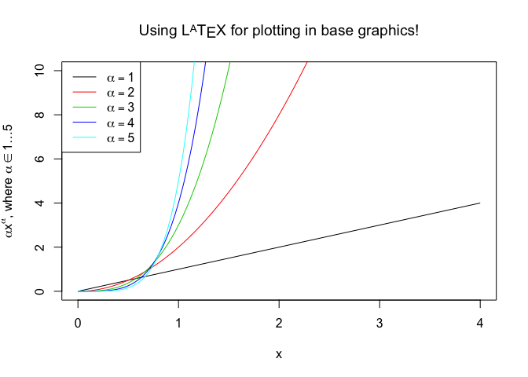
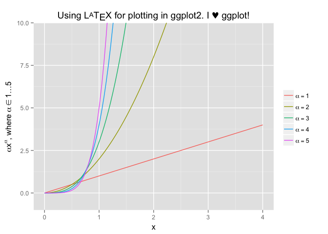
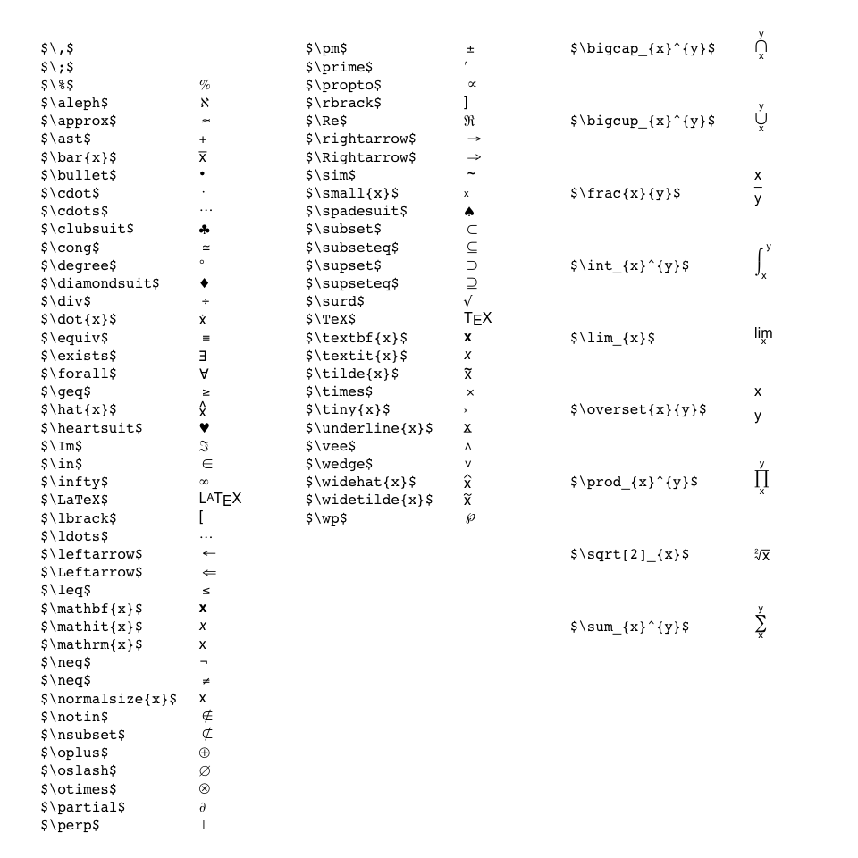
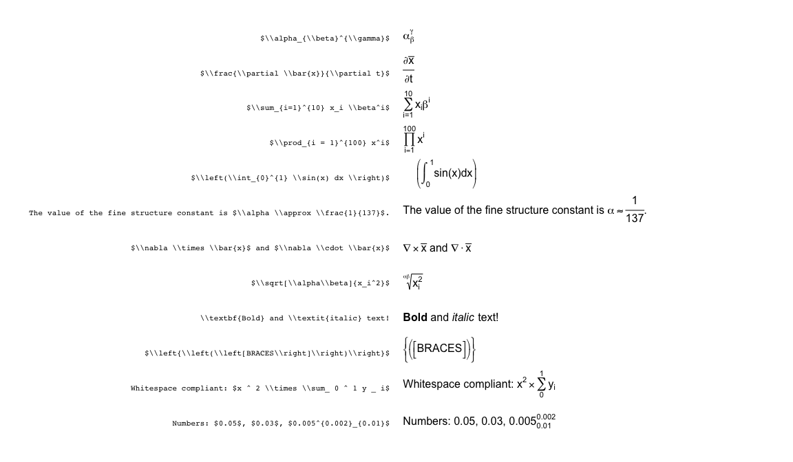

latex2exp
=========

**latex2exp** is an R package that parses and converts LaTeX math formulas to R's [plotmath expressions](http://stat.ethz.ch/R-manual/R-patched/library/grDevices/html/plotmath.html). Plotmath expressions are used to enter mathematical formulas and symbols to be rendered as text, axis labels, etc. throughout R's plotting system. I find plotmath expressions to be quite opaque, while LaTeX is a de-facto standard for mathematical expressions, so this package might be useful to others as well.

Installation
------------

Install this package from CRAN:

``` r
install.packages('latex2exp')
```

You can also install from GitHub using [devtools](http://cran.r-project.org/web/packages/devtools/index.html):

``` r
devtools::install_github('stefano-meschiari/latex2exp')
```

Usage
-----

``` r
library(latex2exp)
```

The `latex2exp` function takes a LaTeX string and returns a plotmath expression suitable for use in plotting, e.g.,

``` r
TeX('$\\alpha^\\beta$')
```

(note it is *always* necessary to escape the backslash within a string, hence the double backslash).

The return value of `TeX()` can be used anywhere a plotmath expression is accepted, including plot labels, legends, and text.

The following example shows plotting in base graphics:

``` r
x <- seq(0, 4, length.out=100)
alpha <- 1:5

plot(x, xlim=c(0, 4), ylim=c(0, 10), 
     xlab='x', ylab=TeX('$\\alpha  x^\\alpha$, where $\\alpha \\in 1\\ldots 5$'), 
     type='n', main=TeX('Using $\\LaTeX$ for plotting in base graphics!'))

invisible(sapply(alpha, function(a) lines(x, a*x^a, col=a)))

legend('topleft', legend=TeX(sprintf("$\\alpha = %d$", alpha)), 
       lwd=1, col=alpha)
```



This example shows plotting in [ggplot2](http://ggplot2.org):

``` r
library(plyr)
x <- seq(0, 4, length.out=100)
alpha <- 1:5
data <- mdply(alpha, function(a, x) data.frame(v=a*x^a, x=x), x)

p <- ggplot(data, aes(x=x, y=v, color=X1)) +
    geom_line() + 
    ylab(TeX('$\\alpha  x^\\alpha$, where $\\alpha \\in 1\\ldots 5$')) +
    ggtitle(TeX('Using $\\LaTeX$ for plotting in ggplot2. I $\\heartsuit$ ggplot!')) +
    coord_cartesian(ylim=c(-1, 10)) +
    guides(color=guide_legend(title=NULL)) +
    scale_color_discrete(labels=lapply(sprintf('$\\alpha = %d$', alpha), TeX)) 
    # Note that ggplot2 legend labels must be lists of expressions, not vectors of expressions

print(p)
```



You can quickly test out what a translated LaTeX string would look like by using `plot`:

``` r
plot(TeX("A $\\LaTeX$ formula: $\\frac{2hc^2}{\\lambda^5} \\, 
               \\frac{1}{e^{\\frac{hc}{\\lambda k_B T}} - 1}$"), cex=2)
```


Syntax
------

Use

``` r
TeX('latexString')
```

to build a plotmath expression, ready for use in plots. If the parser cannot build a correct plotmath expression, it will `stop()` and show the invalid plotmath expression built.

``` r
TeX('latexString', output=c('expression', 'character', 'ast'))
```

If the `output` option is equal to `character`, it will return the string representation of the expression (which could be converted into an expression using `parse(text=)`).

If the `output` option is equal to `ast`, it will return the tree built by the parser (this is only useful for debugging).

------------------------------------------------------------------------

``` r
latex2exp_examples()
```

will show a demo of the supported LaTeX syntax.

------------------------------------------------------------------------

``` r
latex2exp_supported(plot=FALSE)
```

returns a list of supported LaTeX. If `plot=TRUE`, a table of symbols will be plotted.

"Supported" LaTeX
-----------------

Formulas should go between dollar characters ($).

Only a subset of LaTeX is supported, and not 100% correctly. Greek symbols (\\alpha, \\beta, etc.) and the usual operators (+, -, etc.) are supported.

In addition, the following should be supported:

``` r
latex2exp_supported(plot=TRUE)
```



Their rendering depends on R's interpretation of the plotmath expression.

A few examples:

``` r
latex2exp_examples()
```



    ## [1] TRUE

Changes
-------

### 0.4.0 \[08/29/2015\]

-   Deprecated the `latex2exp()` function; use `TeX()` instead.
-   Added `\lbrack` and `\rbrack` to type left and right square brackets.

### 0.3.3 \[08/11/2015\]

Fixes bug \#4 ("fix parsing of numbers"), where certain numbers inside formulas where not parsed correctly.

### 0.3.2 \[07/28/2015\]

Fixes bug \#3 ("subscript and superscript style"). `latex2exp` now renders combined subscripts and superscripts correctly.

### 0.3.1 \[07/02/2015\]

Fixes bug \#2 (white space causes unexpected behaviour). `latex2exp` should now be a bit more compliant with how LaTeX handles whitespace.

### 0.3.0 \[06/30/2015\]

`latex2exp` is now a proper package.

### 0.2.0 \[06/29/2015\]

Formulas must now be enclosed between dollar characters ($), as in LaTeX proper. Text does not need to be enclosed in \\text tags anymore.

FAQ
---

This function will get easily confused by even very simple LaTeX formulas (as I mentioned, it's a work in progress!). Please file a bug.
