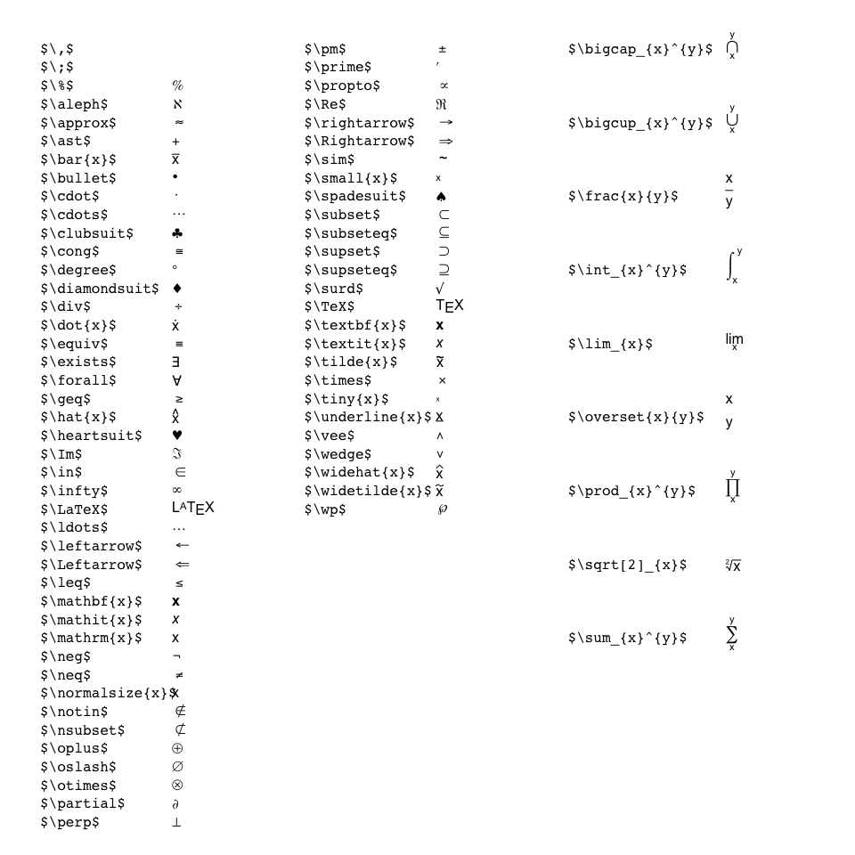

LaTeX2Exp
=========

**latex2exp** is an R function that parses and converts LaTeX math formulas to R's [plotmath expressions](http://stat.ethz.ch/R-manual/R-patched/library/grDevices/html/plotmath.html). Plotmath expressions are used to enter mathematical formulas and symbols to be rendered as text, axis labels, etc. throughout R's plotting system. I find plotmath expressions to be quite opaque and fiddly; LaTeX is a de-facto standard for mathematical expressions, so this script might be useful to others as well.

*Note that at the moment, this script is at very early stages. It /will/ fail for even very straightforward LaTeX formulas. It may improve in the future.*

Usage
-----

Clone this repository and source the script. The script's only dependence are the `stringr` and `magrittr` packages.

``` r
source("./latex2exp.r")
```

The `latex2exp` function takes a LaTeX string and returns a plotmath expression suitable for use in plotting, e.g.,

``` r
latex2exp('\\alpha^\\beta')
```

(note it is *always* necessary to escape the backslash, hence the double backslash).

The return value of latex2exp can be used anywhere a plotmath expression is accepted, including plot labels, legends, and text.

The following example shows plotting in base graphics:

``` r
x <- seq(0, 4, length.out=100)
alpha <- 1:5

plot(x, xlim=c(0, 4), ylim=c(0, 10), xlab='x', ylab=latex2exp('\\alpha  x^\\alpha\\text{, where }\\alpha \\in \\text{1:5}'), type='n', main=latex2exp('\\text{Using }\\LaTeX 2Exp\\text{ for plotting in base graphics}'))

invisible(sapply(alpha, function(a) lines(x, a*x^a, col=a)))

legend('topleft', legend=latex2exp(sprintf("\\alpha = %d", alpha)), lwd=1, col=alpha)
```


This example shows plotting in [ggplot2](http://ggplot2.org):

``` r
library(plyr)
x <- seq(0, 4, length.out=100)
alpha <- 1:5
data <- mdply(alpha, function(a, x) data.frame(v=a*x^a, x=x), x)

p <- ggplot(data, aes(x=x, y=v, color=X1)) +
    geom_line() + 
    ylab(latex2exp('\\alpha  x^\\alpha\\text{, where }\\alpha \\in 1\\ldots 5')) +
    ggtitle(latex2exp('\\text{Using }\\LaTeX 2Exp\\text{ for plotting in ggplot2. I } \\heartsuit\\text{ ggplot!}')) +
    coord_cartesian(ylim=c(-1, 10)) +
    guides(color=guide_legend(title=NULL)) +
    scale_color_discrete(labels=lapply(sprintf('\\alpha = %d', alpha), latex2exp)) # Note that ggplot2 legend labels must be lists of expressions, not vectors of expressions

print(p)
```


You can quickly test out what a translated LaTeX string would look like by using `plot`:

``` r
plot(latex2exp("\\text{A }\\LaTeX\\text{ formula: } \\frac{2hc^2}{\\lambda^5}  \\, \\frac{1}{e^{\\frac{hc}{\\lambda k_B T}} - 1}"), cex=2)
```


Syntax
------

Use

``` r
latex2exp('latexString')
```

to build a plotmath expression, ready for use in plots. If the parser cannot build a correct plotmath expression, it will `stop()` and show the invalid plotmath expression built.

``` r
latex2exp('latexString', output=c('expression', 'character', 'ast'))
```

If the `output` option is equal to `character`, it will return the string representation of the expression (which could be converted into an expression using `parse(text=)`).

If the `output` option is equal to `ast`, it will return the tree built by the parser (this is only useful for debugging).

------------------------------------------------------------------------

``` r
latex2exp_examples()
```

will show a demo of the supported LaTeX syntax.

------------------------------------------------------------------------

``` r
latex2exp_supported(plot=FALSE)
```

returns a list of supported LaTeX. If `plot=TRUE`, a table of symbols will be plotted.

"Supported" LaTeX
-----------------

Only a subset of LaTeX is supported, and not 100% correctly. Greek symbols (\\alpha, \\beta, etc.) and the usual operators (+, -, etc.) are supported.

In addition, the following should be supported:

``` r
latex2exp_supported(plot=TRUE)
```


Their rendering depends on R's interpretation of the plotmath expression.

To render text with spaces or punctuation interspersed in the formula, embed it in `\\text{My text}`.

A few examples:

``` r
latex2exp_examples()
```



FAQ
---

### It's not working even though my LaTeX string is correct

This script will get easily confused by even very simple LaTeX formulas (as I mentioned, it's a work in progress!). Please file a bug.

### The translation is incorrect/Why is this not a proper R package?

The script, at the present stage, is just a quick hack to let me use LaTeX formulas in my scripts.

At some point, I will rewrite this with more sound code and share it as an R package. Stay tuned, and feel free to file bugs.
